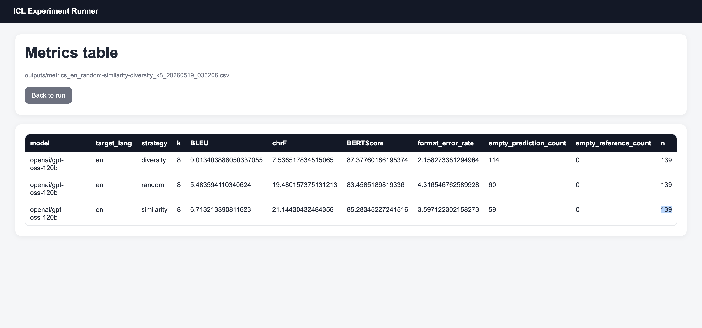

<h1>
  
  ICL Pipeline
</h1>

<p align="center">
  
</p>

## Run

```bash
uv sync
uv run uvicorn web_app:app
```

## CLI examples

Dense E5 retrieval:

```bash
uv run run_baseline.py --target_lang en --strategies similarity diversity --k_list 8
```

BGE-M3 retrieval:

```bash
uv run run_baseline.py --target_lang en --embedding_model BAAI/bge-m3 --strategies similarity --k_list 8
```

BM25 retrieval:

```bash
uv run run_baseline.py --target_lang en --retrieval_backend bm25 --strategies similarity diversity --k_list 8
```

DiPMT++-style 10% run with a full word dictionary and 3 BM25 shots:

```bash
uv run run_baseline.py \
  --target_lang en \
  --retrieval_backend bm25 \
  --strategies similarity \
  --k_list 3 \
  --sample_fraction 0.1 \
  --only_sentences \
  --prompt_mode dipmt_plus \
  --dictionary_path data/chagatai_long_dataset.csv
```

Paper-style DiPMT++ without synonym expansion, using a precomputed GIZA++/giza-py
BLI lexicon filtered at the paper threshold:

```bash
uv run run_baseline.py \
  --target_lang en \
  --retrieval_backend bm25 \
  --strategies similarity \
  --k_list 3 \
  --sample_fraction 0.1 \
  --only_sentences \
  --prompt_mode dipmt_plus \
  --dictionary_path data/chagatai_long_dataset.csv \
  --enable_bli \
  --bli_threshold 0.6 \
  --bli_lexicon_path data/bli_chg_en_giza_10pct.tsv
```

If you have the sillsdev/giza-py `giza.py` runner and MGIZA++ installed, replace
`--bli_lexicon_path ...` with `--giza_py_path /path/to/giza.py`.

Ablations:

```bash
# w/o fuzzy
uv run run_baseline.py --target_lang en --retrieval_backend bm25 --strategies similarity --k_list 3 --sample_fraction 0.1 --only_sentences --prompt_mode dipmt_plus --dictionary_path data/chagatai_long_dataset.csv --enable_bli --bli_threshold 0.6 --bli_lexicon_path data/bli_chg_en_giza_10pct.tsv --disable_lexicon_fuzzy

# w/o BLI
uv run run_baseline.py --target_lang en --retrieval_backend bm25 --strategies similarity --k_list 3 --sample_fraction 0.1 --only_sentences --prompt_mode dipmt_plus --dictionary_path data/chagatai_long_dataset.csv

# w/o synonym
# Same as the paper-style command above for now, because synonym expansion is not enabled.
```

Graph-aware retrieval comparison on a 10% sample:

```bash
uv run run_baseline.py \
  --target_lang en \
  --retrieval_backend graph \
  --strategies graph_common graph_ppr hybrid_graph \
  --k_list 8 \
  --sample_fraction 0.1 \
  --only_sentences
```

Resume an interrupted run:

```bash
uv run run_baseline.py --run_name my_run --resume
```

## Environment

Create `.env` with:

```bash
OPENAI_API_KEY=...
OPENAI_API_KEYS=sk-1,sk-2
OPENAI_MODEL=...
OPENAI_BASE_URL=...
LANGFUSE_PUBLIC_KEY=...
LANGFUSE_SECRET_KEY=...
LANGFUSE_BASE_URL=https://cloud.langfuse.com
```

`OPENAI_BASE_URL` is optional. `OPENAI_API_KEYS` is optional; when present, the
runner uses it as a comma-separated failover pool and switches to the next key
when an LLM API call fails. If `OPENAI_API_KEYS` is set, it takes precedence
over `OPENAI_API_KEY`; `OPENAI_API_KEY` is still supported for single-key runs.

Langfuse is enabled by default when the
`LANGFUSE_*` keys are present: each translation call becomes an `icl-translation`
trace with stable trace/session ids, retrieval metadata, token usage, and
per-trace scores for empty/error/exact-match checks. Pass `--disable_langfuse`
to `run_baseline.py` to keep a run fully local.

After a run, send aggregate eval metrics to the same Langfuse session:

```bash
uv run evaluate.py --predictions_path outputs/<predictions>.csv
```

`evaluate.py` still writes the summary CSV, and also sends BLEU, chrF,
BERTScore, format error rate, empty counts, and `n` as Langfuse session scores
when credentials are configured. Use `--disable_langfuse_scores` to skip remote
score ingestion.

Outputs are written to `outputs/`; dense
embedding caches are written to `embeddings/` and are keyed by model and data
fingerprint.

The graph backend uses an in-memory feature graph over the filtered train split.
`hybrid_graph` lazily uses the same local cached embedding store as dense
retrieval, so no external vector database or graph database is required for the
first comparison.

## Data schema

`data/train.csv` and `data/test.csv` must include:

- `source_text`
- `target_text`
- `source_lang`
- `target_lang`
- `type`
